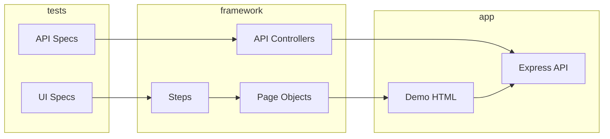

# bookstore-automation-project

Playwright + TypeScript test automation for the **Online Bookstore** mock application.

## Stack

- Playwright Test, TypeScript (strict)
- Page Object Model + Steps layer
- Allure reporting
- Axios API clients (Controller / Builder / Flow)
- ESLint + `eslint-plugin-playwright`
- Mock app: static HTML UI + Express REST API

## Quick start

```bash
npm install
npx playwright install chromium
npm test
```

## Allure report

**Prerequisite:** [JDK 17+](https://adoptium.net/) (required by `allure-commandline` to build the HTML report).  
`npm run allure:*` auto-detects a local JDK if `JAVA_HOME` is missing or invalid. If you see `JAVA_HOME is set to an invalid directory`, remove the broken user/system `JAVA_HOME` variable in Windows environment settings (a bad value like `= 1>&2` breaks the Allure CLI).

Run tests, generate the report, and open it in the browser:

```bash
npm run report
```

Or step by step (e.g. re-open an existing report without re-running tests):

```bash
npm test
npm run allure:generate
npm run allure:open
```

| Output | Description |
|--------|-------------|
| `allure-results/` | Raw results from the last `npm test` (gitignored) |
| `allure-report/` | Generated HTML report (gitignored) |

Tests attach Allure labels via `allureMetadata({ layer, owner })` — **Suites** groups by `layer` then `test.describe` name.

## Demo application

| URL | Description |
|-----|-------------|
| http://localhost:3000/login.html | Login (`user@bookstore.test` / `password123`) |
| http://localhost:3000/catalog.html | Book catalog |
| http://localhost:3000/cart.html | Shopping cart |
| http://localhost:3000/checkout.html | Multi-step checkout |

API base: `http://localhost:3000/api/*`

Start server only: `npm run server`

## Project layout

```
automation/src/main/ui/     # Pages, Steps, Locators, Models
automation/src/main/api/    # Clients, Controllers, Builders, Flows
automation/src/test/        # Specs + fixtures
demo/                       # Static UI
mock-server/                # Express API + in-memory store
```

Path alias: `@automation/*` → `automation/src/*`

## Tests

- **UI** (4 specs): login, search/filter, cart, checkout
- **API** (3 specs): books CRUD, cart, orders

Test state is reset via `POST /api/test/reset` before each test.

## Architecture



## CI (GitHub Actions)

Workflow: `.github/workflows/ci.yml` (push/PR to `main`).

Jobs (order via `needs:`; each job is a fresh VM — reuse is via npm/Playwright caches, not shared disks):

| Job | What it runs |
|-----|----------------|
| `quality` | `typecheck` + `lint` (one `npm ci`) |
| `test` | `npm test` with Playwright (cached browsers) |
| `allure-report` | `npm run allure:generate` → artifact `allure-report` |

Shared setup: `.github/actions/setup-node-project` (`npm ci` + optional Playwright install with cache).

Download the HTML report from the **allure-report** artifact on a workflow run (Actions → run → Artifacts).

There is no external host in CI. Playwright starts the mock app on the runner via `webServer` in `playwright.config.ts`:

- `npm run server` → Express + demo UI on `http://localhost:3000`
- readiness: `GET /health`
- with `CI=true`, `reuseExistingServer` is off (fresh server per run)

Optional env overrides (local or CI): `BASE_URL`, `API_URL`, `PORT` (server port).

## Remaining / bonus (optional)

- [x] GitHub Actions CI
- [ ] Docker Compose
- [ ] Visual regression
- [ ] TestRail reporter (live integration)
