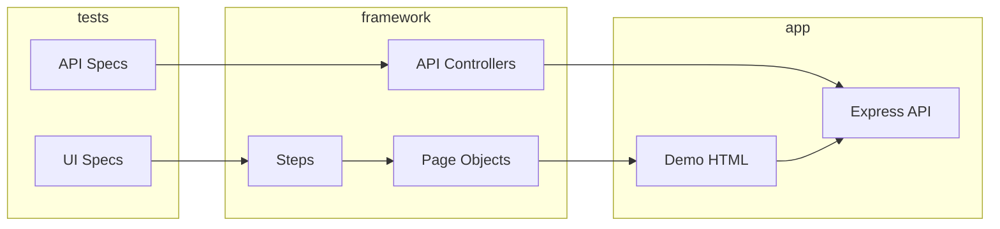

# bookstore-automation-project

Playwright + TypeScript test automation for the **Online Bookstore** mock application.

## Stack

- Playwright Test, TypeScript (strict)
- Page Object Model + Steps layer
- Allure reporting
- Axios API clients (Controller / Builder / Flow)
- ESLint + `eslint-plugin-playwright`
- Mock app: static HTML UI + Express REST API

## Quick start

```bash
npm install
npx playwright install chromium
npm test
```

Allure report:

```bash
npm run allure:generate
npm run allure:open
```

## Demo application

| URL | Description |
|-----|-------------|
| http://localhost:3000/login.html | Login (`user@bookstore.test` / `password123`) |
| http://localhost:3000/catalog.html | Book catalog |
| http://localhost:3000/cart.html | Shopping cart |
| http://localhost:3000/checkout.html | Multi-step checkout |

API base: `http://localhost:3000/api/*`

Start server only: `npm run server`

## Project layout

```
automation/src/main/ui/     # Pages, Steps, Locators, Models
automation/src/main/api/    # Clients, Controllers, Builders, Flows
automation/src/test/        # Specs + fixtures
demo/                       # Static UI
mock-server/                # Express API + in-memory store
```

Path alias: `@automation/*` → `automation/src/*`

## Tests

- **UI** (4 specs): login, search/filter, cart, checkout
- **API** (3 specs): books CRUD, cart, orders

Test state is reset via `POST /api/test/reset` before each test.

## Architecture



## Remaining / bonus (optional)

- [ ] GitHub Actions CI
- [ ] Docker Compose
- [ ] Visual regression
- [ ] TestRail reporter (live integration)
