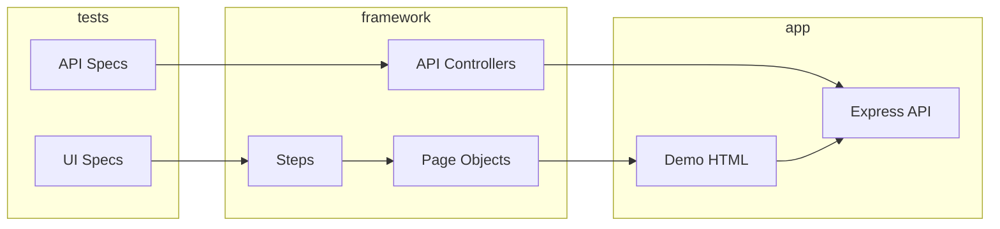

# bookstore-automation-project

Playwright + TypeScript test automation for the **Online Bookstore** mock application.

## Stack

- Playwright Test, TypeScript (strict)
- Page Object Model + Steps layer
- Allure reporting
- Axios API clients (Controller / Builder / Flow)
- ESLint + `eslint-plugin-playwright`
- Mock app: static HTML UI + Express REST API

## Quick start

```bash
npm install
npx playwright install chromium
npm test
```

## Allure report

Requires [JDK 17+](https://adoptium.net/) for `npm run allure:generate`.

Run tests, generate the report, and open it in the browser:

```bash
npm run report
```

`npm run report` always generates and opens Allure even when tests fail (exit code still reflects test result).

Or step by step (e.g. re-open an existing report without re-running tests):

```bash
npm test
npm run allure:generate
npm run allure:open
```

| Output | Description |
|--------|-------------|
| `allure-results/` | Raw results from the last `npm test` (gitignored) |
| `allure-report/` | Generated HTML report (gitignored) |

Tests attach Allure labels via `allureMetadata({ layer, owner })` — **Suites** groups by `layer` then `test.describe` name.

## Demo application

| URL | Description |
|-----|-------------|
| http://localhost:3000/login.html | Login (`user@bookstore.test` / `password123`) |
| http://localhost:3000/catalog.html | Book catalog |
| http://localhost:3000/cart.html | Shopping cart |
| http://localhost:3000/checkout.html | Multi-step checkout |

API base: `http://localhost:3000/api/*`

Start server only: `npm run server`

## Project layout

```
automation/src/main/ui/     # Pages, Steps, Locators, Models
automation/src/main/api/    # Clients, Controllers, Builders, Flows
automation/src/test/        # Specs + fixtures
demo/                       # Static UI
mock-server/                # Express API + in-memory store
```

Path alias: `@automation/*` → `automation/src/*`

## Tests

- **UI** (5 specs): login, search/filter, cart, checkout, visual regression
- **API** (3 specs): books CRUD, cart, orders

Test state is reset via `POST /api/test/reset` before each test (UI via `page` fixture, API via `apiReset` fixture).

### Visual regression

Baselines live in `visual-regression.spec.ts-snapshots/`. **Capture them in Docker** (Linux, same as CI) so Windows/macOS local runs do not drift:

```bash
npm run docker:visual:update   # rewrite PNG baselines from Linux container
npm run docker:test:visual     # verify visual tests in Docker
npm run test:visual            # local Playwright (may differ from CI without Docker baselines)
```

Requires [Docker Desktop](https://www.docker.com/products/docker-desktop/) (or Docker Engine + Compose v2).

### Docker (tests in Linux)

```bash
npm run docker:test              # full suite in container
npm run docker:visual:update     # refresh screenshot baselines (commit updated PNGs)
```

Compose starts `bookstore` (mock server) and `playwright` (`mcr.microsoft.com/playwright:v1.60.0-jammy`, aligned with `package-lock.json`). Tests use `BASE_URL=http://bookstore:3000` — no host `webServer` in config.

### Parallelism

| Approach | Safe with shared mock-server? | Allure |
|----------|-------------------------------|--------|
| `workers > 1` in one run | **No** — races on reset and in-memory store | Single report |
| **CI shards** (2 jobs, 1 worker each) | **Yes** — separate server per job | Merge `allure-results-*` artifacts before generate |

`playwright.config.ts` keeps `workers: 1`. CI uses `--shard=1/2` and `--shard=2/2` in parallel jobs.

## Architecture



## CI

On every push and PR to `main`: **Quality Gates** (typecheck, lint) → **Playwright Tests** → **Allure Report**. Workflow: `.github/workflows/ci.yml`.

**Allure Report:** https://ausievich.github.io/bookstore-automation-project/

## Remaining / bonus (optional)

- [x] GitHub Actions CI
- [x] Docker Compose
- [x] Visual regression
- [ ] TestRail reporter (live integration)
