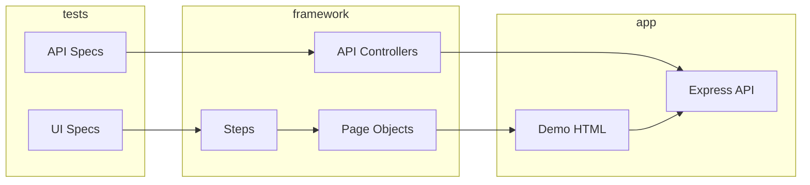

# bookstore-automation-project

Playwright + TypeScript test automation for the **Online Bookstore** mock application.

**Allure Report (CI):** https://ausievich.github.io/bookstore-automation-project/

## Stack

- Playwright Test, TypeScript (strict)
- Page Object Model + Steps layer
- Allure reporting
- Axios API clients (Controller / Builder / Flow)
- ESLint + `eslint-plugin-playwright`
- Mock app: static HTML UI + Express REST API
- Docker Compose (Linux test runs aligned with CI)

## Quick start

```bash
npm install
npx playwright install chromium
npx playwright test
```

> After `npm install`, `npx playwright test` uses the CLI from `@playwright/test`.
> If npx offers to install package `playwright` — dependencies are missing; run `npm install` again.

Recommended for the same environment as CI (including visual baselines):

```bash
npm run docker:test
```

## Allure report (local)

Requires [JDK 17+](https://adoptium.net/) for `npm run allure:generate`.

Run tests, generate the report, and open it in the browser:

```bash
npm run report
```

`npm run report` always generates and opens Allure even when tests fail (exit code still reflects the test result).

Or step by step (per assignment):

```bash
npx playwright test
npx allure generate allure-results -o allure-report --clean
npx allure open allure-report
```

| Output | Description |
|--------|-------------|
| `allure-results/` | Raw results from the last test run (gitignored) |
| `allure-report/` | Generated HTML report (gitignored) |

Tests attach Allure labels via `allureMetadata({ layer, owner })` — **Suites** groups by `layer` then `test.describe` name.

## Demo application

| URL | Description |
|-----|-------------|
| http://localhost:3000/login.html | Login (`user@bookstore.test` / `password123`) |
| http://localhost:3000/catalog.html | Book catalog |
| http://localhost:3000/cart.html | Shopping cart |
| http://localhost:3000/checkout.html | Multi-step checkout |

API base: `http://localhost:3000/api/*`

Start server only: `npm run server`

## Project layout

```
automation/src/main/ui/     # Pages, Steps, Locators, Models
automation/src/main/api/    # Clients, Controllers, Builders, Flows
automation/src/test/        # Specs + fixtures
demo/                       # Static UI
mock-server/                # Express API + in-memory store
```

Path alias: `@automation/*` → `automation/src/*`

## Tests

| Layer | Specs |
|-------|--------|
| **UI** | login, search/filter, cart, checkout, visual regression |
| **API** | books CRUD, cart, orders |

Test state is reset via `POST /api/test/reset` before each test (UI via `page` fixture, API via `apiReset` fixture).

### Visual regression

Baselines: `visual-regression.spec.ts-snapshots/`. Capture and verify in Docker (Linux, same as CI):

```bash
npm run docker:visual:update   # rewrite PNG baselines
npm run docker:test:visual     # verify visual tests
```

`npm run test:visual` on the host may differ from CI without Docker baselines.

Requires [Docker Desktop](https://www.docker.com/products/docker-desktop/) (or Docker Engine + Compose v2).

Compose runs `bookstore` (mock server) and `playwright` (`mcr.microsoft.com/playwright:v1.60.0-jammy`). Tests use `BASE_URL=http://bookstore:3000`.

### CI sharding

CI runs two parallel jobs: `npm run docker:test -- --shard=1/2` and `--shard=2/2`. Each job starts its own Compose stack (mock server + Playwright), so shards do not share in-memory state. Allure artifacts `allure-results-1` and `allure-results-2` are merged before the report is generated.

## Architecture



## CI

On every push and PR to `main`:

**Quality Gates** (typecheck, lint) → **Playwright in Docker** (`npm run docker:test`, 2 shards) → **Allure Report** deployed to GitHub Pages.

Workflow: [`.github/workflows/ci.yml`](.github/workflows/ci.yml)

## Remaining / bonus (optional)

- [x] GitHub Actions CI
- [x] Docker Compose
- [x] Visual regression
- [ ] TestRail reporter (live integration)